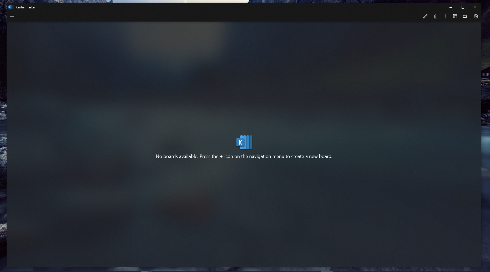
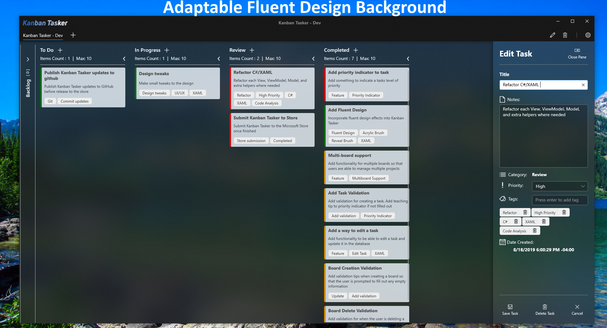
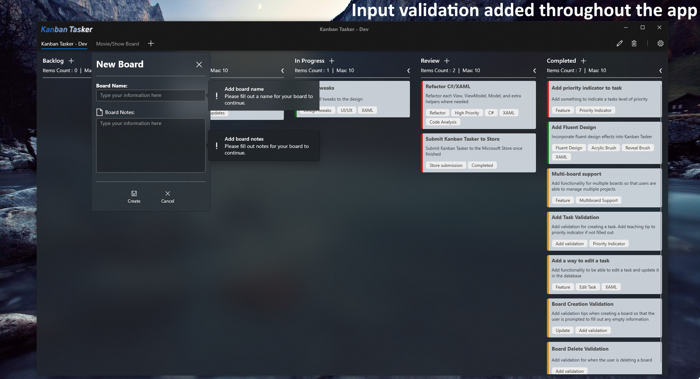

# Kanban Tasker

This Windows 10 Universal Windows Platform (UWP) application uses a kanban board to manage your work and includes dragging across columns to create an easy and simple workflow in each board created.

## Kanban Tasker Details

Created with C#/XAML and the Universal Windows Platform. The UI is created with Extensible Application Markup Language (XAML) and backend is using C#. (Note: Old designs from the start of the app can be found in the *Images* folder)

Uses a kanban UI control created by [Syncfusion](https://www.syncfusion.com) but fully customized to Kanban Taskers style (see corresponding data templates in *BoardView.xaml, and App.xaml*). Also implemented with a Sqlite database to store the tasks/boards and uses create, read, update, and delete (CRUD) operations against the data (For information on viewing the database created by sqlite, look at [Getting Started](#getting-started))

## Kanban Tasker Features

#### A clean, modern UI

#### Simple design with a popout pane to edit and create your tasks
 * Quick access to pane comes from hovering over the task and selecting the edit icon
   * **Note:** Tablet users need to touch and hold the task for a context menu to show (Right-click is enabled for desktop/laptop users too)
 * Tags in the pane can range in width and height. If the tag is longer than the width of the pane, it will wrap to a new row and  increase the height

#### Adaptable Fluent Design Background and Card design
  * Background acrylic brush adapts to colors
  * Hover over a task to view the edit and delete buttons
  * Priority indicator has three options as of now: Low (Green), Medium (Yellow), High (Red)
  * Mouse reveal effect added to the bottom priority indicator border
  * Cards can vary in width and height. Wrapping added to card tags as well 

#### Support for multiple boards and input validation throughout the application:
  * Ability to edit board name and board notes
  * Create as many boards as you need to manage your workflows
  * The work in progress limit is 10 and the error bar indicator will turn red when you reach max items
  * Quickly delete a board and its respective tasks using the button on the navigation menu

#### Ability to collapse columns
  * Support to collapse columns added so you're able to focus on the important tasks at hand

#### Ability to drag cards across columns for easy workflow organization

#### Quick preview of board notes when hovering over board name

#### Scrollbar added to column when the tasks exceed the height of the application

## Getting Started

### Debugging

The program requires a license from Syncfusion to debug since the Kanban Control is a control used by them, but they provide a free community license here: https://www.syncfusion.com/products/communitylicense

Generate a key for the UWP controls and head to App.xaml.cs and add your key into the string "YOUR_API_KEY". 

### Database generated by sqlite

You can view the .db file generated by sqlite with https://sqlitebrowser.org/

* The database file, .db, will be located in your ***Users->AppData (Make sure hidden items is on)->Local->Packages->(Search for db name)***
  * The database name is **ktdatabase.db**
  * All database work is handled and located located in *DataProvider.cs*
* Sqlite Browser should open automatically to your user profile. Navigate to View and select the checkbox to view ***Hidden Items*** so that App Data will show (if not showing already)

### Prerequisites

Due to the requirements for certain Windows 10 effects and controls used, the minimum version required to debug and run the application is **1809**

Minimum version: Windows 10, Version 1809

Target Version: Windows 10, Version 1903

#### Nuget Packages Required:

* Microsoft Sqlite should be installed on your system by default. So, the nuget package *"Microsoft.Data.Sqlite"* or *"Microsoft.Data.Sqlite.Core"* will work 

* *SQLitePCLRaw.bundle_winsqlite3* 

* *Syncfusion.SfKanban.UWP* package should be installed

* Tutorial on these installations can be found on microsoft docs here: https://docs.microsoft.com/en-us/windows/uwp/data-access/sqlite-databases

## Built With

* [Universal Windows Platform](https://developer.microsoft.com/en-us/windows/apps) - The desktop framework used
* [Syncfusion for UWP Kanban Board](https://www.syncfusion.com/uwp-ui-controls/kanban-board) - UI Kanban Board used
* [Sqlite - Started with tutorial by Microsoft](https://docs.microsoft.com/en-us/windows/uwp/data-access/sqlite-databases) - Database Framework 

## Authors

* **Hunter** - *Initial work* - [hjohnson012](https://github.com/hjohnson12)

See also the list of [contributors](https://github.com/hjohnson12/KanbanTasker/graphs/contributors) who participated in this project.

## License

This project is licensed under the MIT License - see the [LICENSE.md](LICENSE.md) file for details
