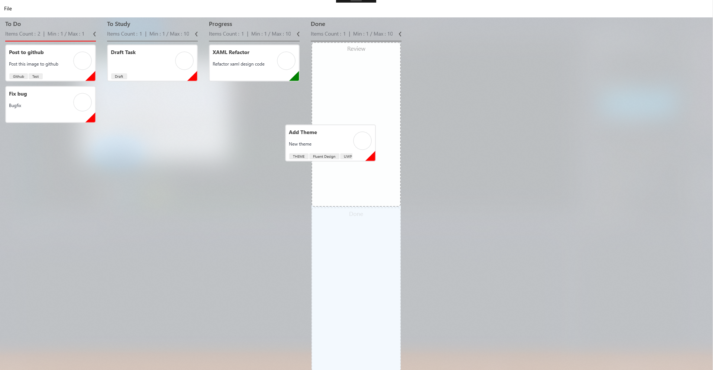
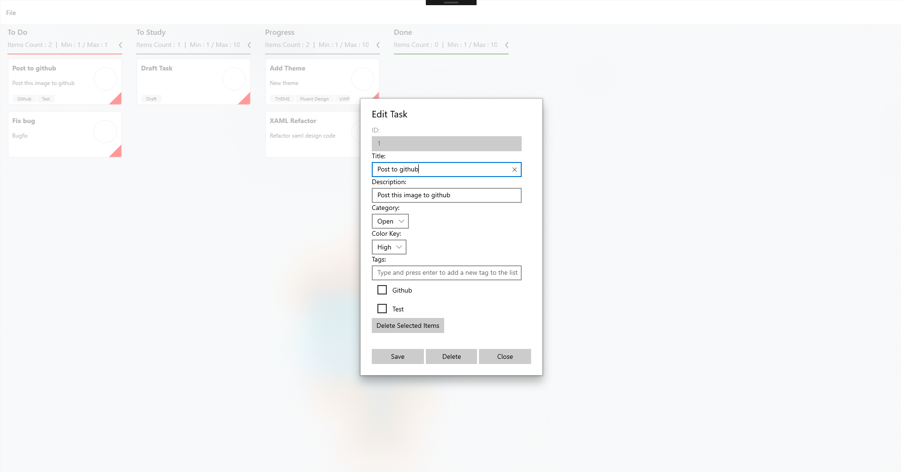

# Kanban Board UWP

This Universal Windows Platform (UWP) application uses a Kanban Board to create a workflow for a specific task or multiple tasks. Still a work in progress, more features coming!

My initial purpose of this application was to track a single programming project and keep track of where I'm at on certain tasks 
for that project.  

Implemented with a Sqlite database to store the tasks and uses Create, Read, Update, and Delete (CRUD) operations against the data. You can view the .db file generated by the project with https://sqlitebrowser.org/

* The database file, .db, will be located in your ***Users->AppData (Make sure hidden items is on)->Local->Packages->(Search for db name)***

* Sqlite Browser should open automatically to your user profile. Navigate to View and select the checkbox to view ***Hidden Items*** so that App Data will show (if not showing already).

##### Basic design with tasks spread across the board:

##### Allows multiple sections in a column and drag and drop between columns seamlessly:

##### New Task Dialog:

You can type in tags into the textbox and it will add them into a listview

##### Edit Task Dialog, each task is assigned a unqiue id:

Tags in the list view are shown

## Getting Started

The program requires a license from Syncfusion since the Kanban Control is a control used by them, but they provide a free community license here: https://www.syncfusion.com/products/communitylicense

Essentially, generate a key for the UWP controls and head to App.xaml.cs and add your key into the string "YOUR_API_KEY". 

***Known Bugs***: 
  * Currently in this view, there are no major bugs found. 
    * To use the Swimlane view as you can see in the samples for Syncfusion UWP Kanban on their website, you'll need to add the *Assignee* property to each KanbanModel object. **Beware**, when updating the swimlane view card items, there is a bug where not all card items show. This bug has been reported with Syncfusion and is track to be patched in their late June 2019 update.

### Prerequisites

Minimum version: Windows 10, Version 1809

Target Version: Windows 10, Version 1903

#### Nuget Packages Required:

* Microsoft Sqlite should be installed on your system by default. So, the nuget package *"Microsoft.Data.Sqlite"* or *"Microsoft.Data.Sqlite.Core"* will work. 

* *SQLitePCLRaw.bundle_winsqlite3.* 

* *Syncfusion.SfKanban.UWP* package should be installed.

* Tutorial on these installations can be found on microsoft docs here: https://docs.microsoft.com/en-us/windows/uwp/data-access/sqlite-databases

## Built With

* [Universal Windows Platform](https://developer.microsoft.com/en-us/windows/apps) - The desktop framework used
* [Syncfusion for UWP Kanban Board](https://www.syncfusion.com/uwp-ui-controls/kanban-board) - UI Kanban Board used
* [Sqlite - Started with tutorial by Microsoft](https://docs.microsoft.com/en-us/windows/uwp/data-access/sqlite-databases) - Database Framework 

## Contributing

[Coming Soon]

## Authors

* **Hunter** - *Initial work* - [hjohnson012](https://github.com/hjohnson012)

See also the list of [contributors](https://github.com/hjohnson12/KanbanBoardUWP/graphs/contributors) who participated in this project.

## License

This project is licensed under the MIT License - see the [LICENSE.md](LICENSE.md) file for details
